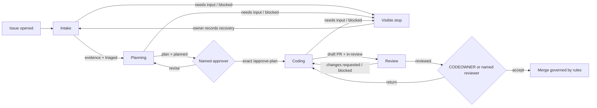

# Agentic Lifecycle Orchestration

> **The Question This Talk Answers:**
> *"How should independently governed workflows hand work off across an issue-to-PR lifecycle?"*

**Duration:** 50 minutes | **Target Audience:** Developers / Team Leads / Platform Engineers

---

## 📊 Content Fitness

| Criterion | Assessment | Notes |
|---|---|---|
| **Relevant** | 🟢 High | Teams automating intake, planning, coding, and review need one explicit handoff contract across independently triggered workflows. |
| **Compelling** | 🟢 High | Labels make state visible, while evidence and named owners prevent a label from becoming accidental authority. |
| **Actionable** | 🟢 High | Four workflow/instruction pairs, a compilation gate, recovery paths, and local measurement definitions support a bounded repository pilot. |

**Overall Status:** 🟢 Ready to use

---

## The Opportunity

### What's Now Possible

- **Coordinate judgment without one privileged agent**
  Four focused workflows can own intake, planning, coding, and review while sharing only visible repository artifacts.

- **Make every transition inspectable**
  Labels identify the current milestone; comments, approval records, pull-request evidence, and Actions logs explain why work moved.[^1][^2]

- **Separate decisions from writes**
  GitHub Agentic Workflows run agent reasoning with read-only access and route declared changes through constrained safe-output handlers.[^3][^4]

- **Preserve human authority at consequential gates**
  A named approver authorizes the plan, and a CODEOWNER or named reviewer accepts residual risk before merge.[^7]

### The Emerging Practice

A lifecycle becomes reliable when each phase can answer five questions: What input is trusted? What decision belongs here? What evidence must be emitted? Which condition stops execution? Who owns recovery?

The useful unit is not a long-running autonomous agent. It is a chain of independently governed workflows connected by durable repository state. Intake can improve without changing coding. Review can tighten without granting planning new authority. A failed phase stops visibly rather than leaking partial work into the next phase.

This talk owns that integrated orchestration contract. Surface choice remains with [Which Copilot Where?](../surfaces/). Reusable context remains with [The Agent Dev Loop](../agent-dev-loop/). Bounded implementation remains with [From Issue to Pull Request](../copilot-web/). Workflow authoring depth remains with [GitHub Agentic Workflows](../agentic-workflows/). Specialist composition and delivery infrastructure remain with [Agent Teams](../agent-teams/) and [Agentic SDLC](../agentic-sdlc/).

---

## How It Works: Evidence-Gated Handoffs

### What It Does

The lifecycle moves through four milestones:

`issue opened` → `lifecycle:triaged` → `lifecycle:planned` → exact `/approve-plan` → draft PR with `lifecycle:in-review` → `lifecycle:reviewed` → human acceptance

A label exposes state but does not authorize work by itself. Every transition requires both a state label and the preceding evidence artifact. Planning requires an intake comment. Coding requires the latest plan plus an explicit approval from an authorized actor. Review requires a linked issue, approval evidence, draft pull request, and deterministic checks.

### Architecture Overview

The workflow sources use the GitHub Agentic Workflows Markdown format. `gh aw compile` converts each source into a generated Actions lock file; the source and lock file are committed together.[^1][^2] The agent receives read-only tools. Declared safe outputs constrain labels, comments, pull requests, and reviews.[^3][^4]



### Implementation Boundary

The four files under [`workflows/`](workflows/) are source templates, not generated lock files. A repository pilot copies them to `.github/workflows/`, compiles them with its installed `gh-aw` release, reviews the generated `.lock.yml` files, and commits both forms. Safe-output schemas can change; successful compilation is the compatibility gate.

The earlier lifecycle example invoked `copilot -p @file` in Actions and parsed prose with shell commands. No current first-party source in this work package substantiates that executor/authentication pattern. These replacements use the documented gh-aw compilation and safe-output model instead. They remain candidates until compiled and exercised in the target repository.

---

## 📦 Key Artifacts

### Primary Artifacts

- **[`workflows/1-intake.md`](workflows/1-intake.md) + [`instructions/intake.md`](instructions/intake.md)** — Classifies one issue, emits intake evidence, and hands ownership to planning.
- **[`workflows/2-planning.md`](workflows/2-planning.md) + [`instructions/planning.md`](instructions/planning.md)** — Produces a bounded plan and waits for explicit approval.
- **[`workflows/3-coding.md`](workflows/3-coding.md) + [`instructions/coding.md`](instructions/coding.md)** — Verifies approval authority, implements only the approved plan, and creates one draft pull request.
- **[`workflows/4-review.md`](workflows/4-review.md) + [`instructions/review.md`](instructions/review.md)** — Compares evidence with intent and routes acceptance to a named human reviewer.

### Deployment Shape

```text
.github/workflows/
├── 1-intake.md
├── 1-intake.lock.yml          # generated by gh-aw
├── 2-planning.md
├── 2-planning.lock.yml        # generated by gh-aw
├── 3-coding.md
├── 3-coding.lock.yml          # generated by gh-aw
├── 4-review.md
└── 4-review.lock.yml          # generated by gh-aw

tech-talks/agentic-lifecycle/instructions/
├── intake.md
├── planning.md
├── coding.md
└── review.md
```

Repository labels required by the candidate are `lifecycle:triaged`, `lifecycle:planned`, `lifecycle:in-review`, `lifecycle:reviewed`, `lifecycle:needs-input`, `lifecycle:changes-requested`, and `lifecycle:blocked`.

---

## 🎯 Mental Model Shift

> **The Core Insight:** A lifecycle handoff is valid only when visible state, required evidence, and the next owner's authority agree.

### Move Toward

- ✅ **State plus evidence**: Pair each label with a structured comment, approval record, or pull-request result → transitions remain auditable.
- ✅ **One decision per workflow**: Let intake classify, planning bound, coding implement, and review advise → authority stays legible.
- ✅ **Named recovery owners**: Every stop identifies the person or team able to supply context, approve scope, repair code, or accept risk → stalled work has a route forward.
- ✅ **Local outcome measurement**: Derive phase timing and rework from repository timestamps → expansion rests on observed results.

### Move Away From

- 🔄 **Labels as authorization**: A status label records a milestone → combine it with the evidence that permits the next action.
- 🔄 **Implicit plan acceptance**: Silence and reactions are ambiguous → require one exact command from an authorized approver.
- 🔄 **Agent review as merge approval**: Agent findings are advisory → let deterministic checks and named humans retain configured authority.

### Move Against

- 🛑 **Hidden fall-through**: Continuing after missing context or a failed check moves uncertainty downstream → emit a stop label and `noop`.
- 🛑 **Scope expansion during coding**: An implementation that invents work bypasses plan authority → return drift to planning for a new approval.
- 🛑 **Unmeasured performance promises**: Generic savings figures obscure repository variation → establish a local baseline before setting a target.

> **What This Looks Like:** Issue `#482` enters intake with acceptance criteria. Intake records ownership and duplicate evidence. Planning names files, tests, rollback, and `@maintainer` as approver. Only `@maintainer`'s exact `/approve-plan` starts coding. The draft PR includes command results and names `@payments-codeowners` for acceptance. A failing integration check adds `lifecycle:blocked`; the implementation owner repairs it, review reruns, and the human reviewer makes the final decision.

---

## When to Use This Pattern

### Decision Tree

```text
Q: Does one repository task need several independently governed judgments?
├─ No, the task is one bounded implementation
│  └─ Route to From Issue to Pull Request
├─ Yes, and each phase has observable evidence and a named owner
│  └─ Use lifecycle orchestration
├─ Yes, but phases need parallel isolated specialists
│  └─ Route composition to Agent Teams; retain lifecycle gates
└─ Yes, but CI, ownership, or rulesets cannot enforce acceptance
   └─ Build the trust infrastructure in Agentic SDLC first
```

### Use This Pattern When

- Issue intake, planning, implementation, and review have different owners or permissions.
- Repository labels and comments are acceptable durable coordination artifacts.
- The task fits one repository and can end in one bounded draft pull request.
- CODEOWNERS, rulesets, and deterministic checks can carry acceptance authority.

### Don't Use This Pattern When

- A single interactive session can complete and validate the task with less coordination overhead.
- Work crosses repositories or production systems without an established orchestration and authority model.
- The issue cannot express acceptance criteria or the repository lacks runnable validation.
- A stop label would be ignored and downstream workflows could proceed regardless.

---

<!-- 🎬 MAJOR SECTION: Lifecycle Contract -->
## 1. Make the State Machine Visible

The lifecycle keeps success milestones as durable labels and failure states as explicit stops.

| Phase | Trigger | Required evidence | Success | Stop | Next owner |
|---|---|---|---|---|---|
| Intake | Issue opened | Structured issue input | `lifecycle:triaged` | `needs-input` or `blocked` | issue triage owner |
| Planning | Triaged label event | Intake evidence and repo context | `lifecycle:planned` | `needs-input` or `blocked` | named plan approver |
| Coding | Exact approval comment | Latest plan and authorized approval | `lifecycle:in-review` | `needs-input` or `blocked` | implementation owner |
| Review | Draft PR event | Plan, approval, diff, CI | `lifecycle:reviewed` | `changes-requested` or `blocked` | CODEOWNER or named reviewer |

Success labels accumulate as audit milestones. A stop label has precedence over every success label. Recovery requires a human-authored change, removal of the stop label, and a new workflow run; discussion alone does not silently restart work.

The planning/coding boundary is the central authority gate:

```markdown
### Approval
Named plan approver: @maintainer
Comment exactly `/approve-plan` to authorize this plan.
```

The coding workflow verifies the exact command, `lifecycle:planned`, plan freshness, and the commenter's repository authority. An unauthorized approval becomes an observable `noop`, not a partial implementation.

---

<!-- 🎬 MAJOR SECTION: Intake and Planning -->
## 2. Turn an Issue into an Approved Contract

### Intake Owns Eligibility

Intake decides whether an issue is specific, non-duplicative, and routable enough to plan. Its instruction contract requires one visible input and one structured result:

```markdown
<!-- lifecycle:phase=intake result=pass -->
## Lifecycle intake
- Candidate duplicates: #123 (reason) or none found
- Type: bug | feature | docs | question | other
- Area: repository-supported component or unknown
- Routing owner: team, CODEOWNER, or unassigned
- Evidence: issue fields and repository paths inspected
- Intake completed: 2026-09-15T14:03:00Z
- Next owner: issue triage owner
```

Missing reproduction steps, ambiguous ownership, and likely duplicates stop here. That keeps planning from laundering uncertain input into a confident-looking plan.

### Planning Owns Scope

Planning reads the intake evidence, repository instructions, source, tests, ownership rules, and similar merged work. The output separates in-scope work, exclusions, commands, expected signals, risk, and rollback. The label `lifecycle:planned` means a plan exists; it never means the plan is approved.

A plan stops when validation is unavailable, ownership crosses an unrepresented boundary, or rollback requires authority not present in the issue. The named plan approver either supplies context, requests a revision, or posts the exact approval command.

---

<!-- 🎬 MAJOR SECTION: Coding and Review -->
## 3. Preserve Authority from Approval to Merge

### Coding Owns Plan Execution

The coding phase has one delegation boundary: implement the latest approved plan in one repository and return one draft pull request. GitHub's coding-agent model similarly returns work through a pull request for review rather than bypassing repository governance.[^5]

```yaml
safe-outputs:
  create-pull-request:
    title-prefix: "[lifecycle] "
    labels: [agent-generated, lifecycle:in-review]
    draft: true
    max: 1
```

The draft pull request records the issue, approver, approval URL, files changed, plan deviations, exact validation commands, results, and review owner. A failed required check, stale approval, unavailable environment, or scope expansion stops coding. Tests, rulesets, and security controls are never weakened to force progress.

### Review Owns Evidence Synthesis

Review compares the diff with the approved plan, maps acceptance criteria to evidence, inspects deterministic check results, and reports high-confidence findings. The workflow submits `COMMENT`, not `APPROVE`. That distinction preserves the named human reviewer's authority.

```markdown
<!-- lifecycle:phase=review result=pass|changes-requested|blocked -->
- Plan alignment: pass | drift detected
- Deterministic checks: names and results
- Findings: severity, location, evidence, remediation
- Residual risk: concise statement
- Human acceptance owner: @CODEOWNER or named reviewer
```

Plan drift returns to planning. Reparable defects return to coding. Missing ownership or required evidence blocks the lifecycle. `lifecycle:reviewed` means the evidence is ready for human acceptance, not that merge is permitted.

---

<!-- 🎬 MAJOR SECTION: Measurement and Recovery -->
## 4. Measure the Handoffs Locally

The source lifecycle's timing and accuracy figures were illustrative, not repository measurements. This candidate starts with definitions, then lets the pilot establish its own baseline.

| Outcome | Start | End | Quality companion |
|---|---|---|---|
| Intake | Issue `created_at` | Intake marker comment timestamp | duplicate reopen rate; routing corrections |
| Planning | Intake pass timestamp | Plan marker timestamp | plans revised after approval; scope drift |
| Coding | Authorized approval timestamp | Draft PR `created_at` | first-pass required-check rate; plan deviations |
| Review | PR creation or latest synchronization | Review marker timestamp | change-request rate; escaped defects after merge |

Workflow markers, issue and pull-request timelines, and Actions logs provide the raw evidence.[^2][^4][^6] Report medians and sample sizes. Keep stopped runs visible rather than deleting them from the denominator.

### Recovery Ledger

For each `needs-input`, `changes-requested`, or `blocked` event, record:

- phase and timestamp;
- stop reason;
- owner able to recover the work;
- evidence required to resume;
- resume timestamp or final disposition.

This ledger answers the practical question behind orchestration: does the lifecycle reduce coordination time without hiding uncertainty or transferring unowned work downstream?

---

## Real-World Use Cases

### High-Volume Issue Intake

A repository receives enough issues that duplicate checks and routing consume regular maintainer attention. The pilot measures issue creation to intake evidence, routing corrections, and duplicate reopen rate. Continuation requires faster intake without a higher correction rate.

### Bounded Maintenance Work

Dependency updates and focused defect fixes have known commands, one repository boundary, and clear CODEOWNERS. Planning records rollback and approval; coding returns one draft pull request; review maps required checks to acceptance evidence. Plan deviation rate reveals whether tasks are bounded enough for this lifecycle.

### Regulated Ownership Boundary

Changed files require a domain CODEOWNER and passing policy checks. Agent review can synthesize findings, but `lifecycle:reviewed` only routes the evidence to that owner. Merge remains unavailable until repository rules and the named reviewer agree.[^7]

---

## What You Can Do Today

### 15 Minutes — Prove the Contract

- **Try:** Trace one closed issue and pull request through the four phase contracts without deploying automation.
- **Expected signal:** Every phase has a visible input, result, stop condition, recovery owner, and named final reviewer.
- **Validate:** Mark any missing item; a single missing authority or evidence field prevents pilot enrollment.

### 1 Hour — Compile the Candidate

- **Build:** Copy the four workflow sources to `.github/workflows/`, create the lifecycle labels, and compile each source with the installed `gh-aw` release.[^1][^2]
- **Expected signal:** Four generated lock files expose read-only agent jobs and constrained write handlers.
- **Validate:** Review compilation output and generated permissions; reject any undeclared write path or schema mismatch.

### 2–4 Hours — Run a Bounded Pilot

- **Pilot:** Use one low-risk issue in a non-production repository with a named plan approver and CODEOWNER.
- **Success measure:** Capture all four phase timestamps, stop events, validation results, and human dispositions.
- **Boundary:** Stop the pilot on an unauthorized transition, missing audit artifact, unowned recovery, or attempted merge bypass.

### Apply It to Your Work

- **Candidate task:** Select one single-repository issue with explicit acceptance criteria and runnable checks.
- **Decisive context:** Record repository instructions, relevant files, validation commands, ownership rules, and rollback limits.
- **Delegation and authority:** Let workflows classify, plan, implement, and advise; reserve plan approval and residual-risk acceptance for named humans.
- **Evidence:** Compare local intake, planning, coding, and review timings with correction, rework, and stop rates before expanding the lifecycle.

---

## Related Patterns

- **[Which Copilot Where?](../surfaces/)** — Chooses the execution surface before a task enters this lifecycle.
- **[The Agent Dev Loop](../agent-dev-loop/)** — Builds the reusable repository context that planning consumes.
- **[From Issue to Pull Request](../copilot-web/)** — Defines which implementation work is bounded enough to delegate.
- **[GitHub Agentic Workflows](../agentic-workflows/)** — Owns workflow syntax, compilation, safe outputs, and operational debugging.
- **[Agent Teams](../agent-teams/)** — Owns specialist composition when a phase needs isolated parallel workstreams.
- **[Agentic SDLC](../agentic-sdlc/)** — Owns CI, rulesets, repository topology, and trust infrastructure at higher throughput.

---

## References

### Official Documentation

[^1]: **[GitHub Agentic Workflows overview](https://github.github.com/gh-aw/introduction/overview/)** — Markdown workflow model and core concepts.
[^2]: **[How GitHub Agentic Workflows work](https://github.github.com/gh-aw/introduction/how-they-work/)** — Compilation, lock files, execution, and audit markers.
[^3]: **[GitHub Agentic Workflows security architecture](https://github.github.com/gh-aw/introduction/architecture/)** — Read-only agent execution and isolated write handling.
[^4]: **[GitHub Agentic Workflows safe outputs](https://github.github.com/gh-aw/reference/safe-outputs/)** — Constrained repository output types and validation.
[^5]: **[About the GitHub Copilot coding agent](https://docs.github.com/en/copilot/concepts/coding-agent/coding-agent)** — Repository task execution and pull-request delivery.
[^6]: **[Workflow syntax for GitHub Actions](https://docs.github.com/en/actions/reference/workflow-syntax-for-github-actions)** — Events, permissions, expressions, and workflow execution semantics.
[^7]: **[About code owners](https://docs.github.com/en/repositories/managing-your-repositorys-settings-and-features/customizing-your-repository/about-code-owners)** — File ownership and review routing.
