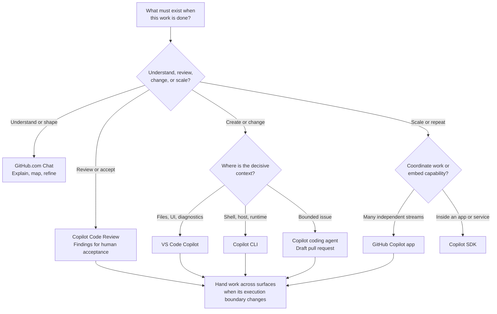

# Which Copilot Where? A Practical Surface Router

> **The Question This Talk Answers:**
> *"Which Copilot surface fits this work, its constraints, and its desired outcome — and what capability should the team build next?"*

**Duration:** 45 minutes | **Target Audience:** Cross-functional teams choosing where agentic work should happen

---

## 📊 Content Fitness

| Criterion | Assessment | Notes |
|-----------|-----------|-------|
| **Relevant** | 🟢 High | Copilot now spans local, cloud, desktop, browser, and embedded experiences; teams need a repeatable routing method. |
| **Compelling** | 🟢 High | The strongest choice comes from execution locality and delivery model, which often points beyond the most familiar interface. |
| **Actionable** | 🟢 High | A decision tree, surface contract, and role-goal scenarios make the framework usable during real work. |

**Overall Status:** 🟢 Ready to use

---

## The Opportunity

### What's Now Possible

- **Keep local work close to its richest context**
  VS Code and Copilot CLI can operate where source, tools, runtime state, and human feedback already meet.[^1][^2]

- **Delegate bounded work to GitHub**
  The Copilot coding agent can take a repository task, work in a GitHub-hosted environment, and return a pull request for review.[^3]

- **Coordinate several streams from one desktop**
  The GitHub Copilot app provides a fleet view across agent sessions, repositories, pull requests, and automations.[^4]

- **Run parallel sessions beside active code**
  The VS Code Agents window supports concurrent sessions across workspaces with isolated worktrees, inline changes, and active human steering.[^7]

- **Add AI review to the pull-request loop**
  GitHub Copilot Code Review analyzes changes on GitHub.com and in supported IDE workflows, returning findings for human review.[^10]

- **Bring Copilot into a product or workflow**
  The GitHub Copilot SDK exposes agent capabilities for applications, services, and domain-specific automations.[^5]

- **Explore repository knowledge from a browser**
  Copilot Chat on GitHub answers questions about repositories, issues, pull requests, and GitHub activity without requiring a local checkout.[^6]

### The Emerging Practice

Copilot is becoming a family of execution surfaces around related agent capabilities. The useful question has shifted from “Does Copilot support this task?” to “Where can this task run with the right context, control, and delivery path?”

That distinction matters because the same prompt can represent very different work. “Fix this deployment failure” might mean an interactive terminal investigation, an editor-led code change, a delegated repository task, or an event-driven remediation service. Each version has a different execution boundary and a different best surface.

The routing method in this talk begins with the work, then selects the surface. Role remains important because it shapes goals and constraints, yet no role maps permanently to one interface. A developer can delegate through GitHub; a product lead can explore through GitHub Chat; a platform engineer can diagnose interactively in the CLI and later encode the proven workflow with the SDK.

---

## How It Works: The Surface Router

### What It Does

The Surface Router begins with two independent dimensions: **control location**, where the human steers and reviews, and **execution location**, where agent tools run or analysis occurs. Five additional dimensions complete the contract: required context, interaction pattern, autonomy, delivered artifact, and review owner. Intent, decisive context, and delivery shape drive the first route. Interaction, autonomy, and review ownership then break ties.

### The Surface Landscape

| Where you control the work | Human experience | Where work happens | Best-fit job |
|----------------------------|------------------|--------------------|--------------|
| **VS Code** | Editor or Agents window | Local workspace, connected host, or GitHub-hosted session | Build, validate, and steer parallel sessions beside code |
| **Copilot CLI** | Terminal | Current machine or remote host shell | Diagnose and automate beside runtime state |
| **GitHub.com** | Browser, issue, or pull request | GitHub service or GitHub-hosted environment | Explore with Chat, implement with coding agent, analyze with Code Review |
| **GitHub Copilot app** | Local desktop control plane | Local or GitHub-hosted environment per stream | Coordinate sessions, repositories, pull requests, and automations |
| **Your product** | Application-defined UI or API | Application-defined runtime | Embed a proven workflow with the Copilot SDK |

The landscape separates control location from execution location. The GitHub Copilot app is a local desktop control surface that coordinates local and GitHub-hosted streams. On GitHub itself, Chat explores, the coding agent implements, and Code Review analyzes changes.[^3][^4][^6][^10]

### Two Multi-Stream Control Surfaces

- **VS Code agent mode and Agents window** — choose them when several sessions still need close contact with workspaces, editor diffs, diagnostics, local or remote development environments, and active steering.[^7]
- **GitHub Copilot app** — choose it when the unit of work is a fleet of sessions, issues, pull requests, or repeatable automations across repositories and environments.[^4]

### Architecture Overview

The surfaces differ primarily in the context and controls supplied by their host. A control surface and an execution environment are related but separate: VS Code, the CLI, and the Copilot app can each coordinate work beyond the machine displaying the interface. The router selects the surface that offers the clearest control and review contract for the decisive context; execution can then remain local or move to a GitHub-hosted environment.

The strongest route preserves the context that is expensive to reconstruct. A live process failure belongs near its runtime. A multi-file implementation with active human steering belongs near the editor. A bounded backlog item can move to a cloud agent because the issue, repository, and pull-request workflow already define its operating boundary.

---

## 🖼️ Visual Assets

### Primary Decision Tree



The diagram is also available as [`surface-decision-tree.mmd`](surface-decision-tree.mmd) for reuse in documentation and generated visuals.

---

## 📦 Key Artifacts

### Primary Artifacts

- **[`surface-contracts.yml`](surface-contracts.yml)** — Comparable contracts for all seven Copilot experiences.
- **[`surface-decision-tree.mmd`](surface-decision-tree.mmd)** — Mermaid source for the primary routing flowchart.
- **[`role-goal-scenarios.yml`](role-goal-scenarios.yml)** — Test cases showing how roles, goals, and constraints resolve to a surface.
- **[`adoption-roadmap.yml`](adoption-roadmap.yml)** — Prescriptive training paths from first engagement through multi-agent operation.

---

## 🎯 Mental Model Shift

> **The Core Insight:** Start with eligible surfaces, preserve the work's decisive context, then match control, review ownership, and delivery model.

### Move Toward (Embrace These Patterns)

- ✅ **Route by execution locality**: Keep runtime investigations near the shell and code-shaping work near the editor → less context reconstruction.
- ✅ **Specify the desired artifact**: Name an explanation, workspace diff, pull request, or application event → clearer surface selection.
- ✅ **Treat delegation as a boundary change**: Move bounded repository work to GitHub-hosted execution → local attention returns to interactive work.
- ✅ **Compose surfaces over a task lifecycle**: Explore, execute, delegate, and review through different hosts → each phase receives appropriate context.

### Move Away From (Retire These Habits)

- 🔄 **One favorite surface for every task**: Familiarity can hide a context mismatch → route from the work contract each time.
- 🔄 **Role-only recommendations**: Roles contain many modes of work → combine role, goal, locality, and output.
- 🔄 **“Web” as a single capability**: Browser chat and cloud execution have separate contracts → name GitHub.com Chat or coding agent explicitly.

### Move Against (Active Resistance)

- 🛑 **Embedding the SDK for a one-off task**: Product integration adds lifecycle and governance work → use an existing interactive surface.
- 🛑 **Delegating work with hidden local dependencies**: Cloud execution lacks uncommitted state and private runtime context → keep the task in VS Code or CLI until the boundary is portable.
- 🛑 **Moving sensitive data only to gain an interface**: Data movement can expand risk and delay → select a surface that runs where the data already lives.

> **What This Looks Like:** A deployment failure begins in Copilot CLI on the affected host and is fixed and validated in VS Code. The incident closes there. If prevention work remains, a separate bounded issue asks the coding agent to add regression coverage and update the runbook, returning a draft pull request for human review.

---

<!-- 🎬 MAJOR SECTION: Map the Surfaces -->

## 1. Map the Surfaces

Surface selection becomes clearer when the landscape is visible and product names are translated into operating contracts.

```yaml
# Excerpt from surface-contracts.yml
cli:
  requiredContext: [filesystem, shell_state, runtime_tools, host_local_data]
  interaction: [interactive, planned, programmatic]
  delivery: [diagnosis, command_result, file_change, delegated_work]
  reviewOwner: immediate_human_at_prompt

codingAgent:
  requiredContext: [github_repository, bounded_issue, repository_configuration]
  interaction: [asynchronous_delegation, pull_request_feedback]
  delivery: [draft_pull_request, implementation_evidence]
  reviewOwner: pull_request_reviewer

sdk:
  requiredContext: [application_defined_data, custom_tools, domain_events]
  interaction: [api_driven, event_driven, application_defined]
  delivery: [application_defined_response, domain_action, workflow_event]
  reviewOwner: application_defined
```

### Contract Dimensions

1. **Control location** — editor, terminal, browser, desktop app, or product-defined UI where a person steers and reviews.
2. **Execution location** — local development environment, remote host, GitHub-managed service, GitHub-hosted environment, or application runtime.
3. **Context ownership** — editor state, shell state, repository collaboration data, or domain data supplied by an application.
4. **Interaction** — synchronous steering, asynchronous delegation, fleet coordination, or programmatic invocation.
5. **Autonomy** — suggestion, planned action, bounded execution, or application-controlled operation.
6. **Delivery** — explanation, workspace change, command result, pull request, or domain event.
7. **Review owner** — the person or product control that accepts, rejects, or escalates the result.

### Role Finds the Question; Context Finds the Surface

A role quickly identifies the likely goals and constraints. Execution locality then resolves the route. DevOps work can mean live shell diagnosis, editor-based infrastructure changes, delegated repository maintenance, or a custom incident bot. The same role can route to CLI, VS Code, coding agent, or SDK based on the current work contract.

Use the role to open two practical questions:

1. **When are you reaching for help?** Name the moment in the workflow: exploring, responding, coordinating, delegating, or scaling a proven practice.
2. **What must exist when the work is done?** Name the artifact: an answer, diagnosis, reviewed change, pull request, coordinated workstream, or embedded capability.

The answers describe the work more reliably than a job title alone.

### Run the Routing Questions

The router uses a small sequence of discriminating questions. Each question removes surfaces whose host cannot satisfy the task.

### Question 1: Is Copilot the product or part of the product?

- **Part of an application, bot, portal, or service** → **Copilot SDK**
- **A practitioner-facing environment for accomplishing the task** → continue routing

The SDK earns its own first branch because embedding creates software ownership: authentication, tools, policy, observability, deployment, and support become part of the product contract.[^5]

### Question 2: Does the work need understanding, review, or change?

- **Repository explanation, issue summary, or navigation** → **GitHub.com Chat**
- **Pull-request or changed-code analysis** → **Copilot Code Review**
- **Commands, file changes, tests, or implementation** → continue routing

This branch separates understanding from action. GitHub.com Chat offers low-friction repository exploration; execution requires a host with tools and an explicit change-delivery path.[^6]

### Question 3: Where does the decisive context live?

- **Editor buffers, symbols, diagnostics, visual diffs** → **VS Code Copilot**[^1]
- **Shell, filesystem, running services, machine-local tools** → **Copilot CLI**[^2]
- **Issue, repository, and GitHub pull-request workflow** → **Copilot coding agent**[^3]

### Question 4: How many independent delegated streams exist?

- **One bounded repository task** → **Copilot coding agent**
- **Several sessions requiring coordination and review** → **GitHub Copilot app**[^4]

### Tie-Breakers

| If the task needs... | Favor |
|----------------------|-------|
| Visual inspection of edits, diagnostics, and parallel workspace sessions | VS Code Copilot |
| Runtime commands and host-local evidence | Copilot CLI |
| Asynchronous issue-to-PR delivery | Copilot coding agent |
| PR findings before human approval | Copilot Code Review |
| Fleet coordination across repositories, PRs, and automations | GitHub Copilot app |
| Repository understanding with minimal setup | GitHub.com Chat |
| A custom trigger, UI, toolchain, or output | Copilot SDK |

When two surfaces remain plausible, ask who steers the work and who reviews the result. Immediate steering favors VS Code or CLI. Asynchronous pull-request review favors the coding agent. One owner coordinating several asynchronous streams favors the Copilot app. Application-defined approval and consumer experiences favor the SDK.

---

<!-- 🎬 MAJOR SECTION: Start by Role -->

## 2. Start by Role

The scenarios below treat roles as starting context and goals as routing inputs. Each outcome is testable: it names a surface, an artifact, and the reason competing surfaces lose fit.

```yaml
# Excerpt from role-goal-scenarios.yml
- role: software_developer
  goal: refactor_across_workspace
  constraints: [interactive_review, editor_diagnostics]
  route: vscode
  outcome: reviewed_workspace_diff

- role: devops_engineer
  goal: diagnose_live_service_failure
  constraints: [host_local_logs, shell_tools, immediate_steering]
  route: cli
  outcome: diagnosis_and_validated_commands

- role: platform_engineer
  goal: add_agentic_triage_to_internal_portal
  constraints: [custom_trigger, domain_tools, structured_response]
  route: sdk
  outcome: embedded_triage_workflow
```

### As an X, Start Here

| Role | When they reach for Copilot | What they need afterward | Best starting surface | Likely handoff |
|------|-----------------------------|--------------------------|-----------------------|----------------|
| **Product manager** | Before refining or prioritizing work in an unfamiliar repository | Evidence-backed brief and a bounded issue | **GitHub.com Chat** | **Coding agent** when the issue is ready to implement |
| **Platform operations team** | While diagnosing infrastructure or service behavior with host-local evidence | Validated diagnosis, reproducible commands, and a remediation boundary | **Copilot CLI** | **VS Code** when remediation becomes a reviewable infrastructure change |
| **Incident commander** | During a live service event with host-local evidence | Diagnosis, validated commands, and a clear remediation boundary | **Copilot CLI** | **VS Code** or **coding agent** once the fix becomes repository work |
| **Security analyst** | While proving how to investigate a recurring alert | Reproducible triage steps and decision criteria | **Copilot CLI** | **Copilot SDK** when the proven workflow should run on every alert |
| **Engineering manager** | When several independent, well-scoped work items are ready | Visible progress and a reviewable set of pull requests | **GitHub Copilot app** | Preferred review surface when each pull request is ready |
| **Technical writer** | After a bounded product or API change makes documentation stale | Verified documentation update delivered through normal review | **Copilot coding agent** | **VS Code** for editorial inspection and refinement |
| **Support engineer** | When a customer report must be connected to repository behavior | Repository explanation, reproduction path, and escalation-ready issue | **GitHub.com Chat** | **Copilot CLI** for local reproduction or **coding agent** for a bounded fix |
| **Quality engineer** | When an agent-generated change needs acceptance evidence before merge | Review findings, reproduced behavior, and an acceptance decision | **Copilot Code Review** | **VS Code** or **CLI** when a finding needs reproduction |
| **Product designer** | When design intent must be traced into an existing interface | Implementation map, reviewed UI change, and visual acceptance evidence | **GitHub.com Chat** | **VS Code** for iteration, then **Code Review** for implementation risk |
| **Platform owner** | While proving a workflow that may later serve many teams | A validated workflow with visible tools, policy, and outputs | **VS Code Copilot** | **Copilot SDK** when the proven workflow should become a product capability |

These are lenses, not assignments. A security analyst investigating one alert and a platform owner productizing that investigation should choose different surfaces even when they share the same domain and tools. Every route ends with an acceptance contract: name who reviews the artifact, what evidence they inspect, and what triggers escalation.

---

<!-- 🎬 MAJOR SECTION: Build Adoption Maturity -->

## 3. Build Adoption Maturity

The four engagement phases provide a telemetry-based starting signal. Repeatedly producing reviewed outcomes with appropriate controls demonstrates capability. Use engagement to locate a likely starting point, then use evidence to prescribe the next path. The phase labels below mirror a rolling 28-day engagement report; teams can choose a review cadence that fits their delivery cycle.

### Four-Phase Roadmap

| Phase | Engagement signal | Capability objective | Prescribed core path | Exit evidence |
|-------|-------------------|----------------------|----------------------|---------------|
| **0 — Activate** | Licensed, but not yet engaged | Complete one relevant task with human review | [Workshop orientation](../../workshop/00-orientation/) → [VS Code latest](../vscode-latest/) → this Surface Router | One real task completed, output reviewed, and the chosen surface explained |
| **1 — Standardize** | Code completion or IDE agent use on at least two days | Make interactive assistance repeatable and repository-aware | [Repository instructions](../../workshop/01-instructions/) → [Plan mode](../../workshop/02-agent-plan-mode/) → [Agent development loop](../agent-dev-loop/) → [Code review](../copilot-code-review/) | Shared instructions exist; a plan-led change passes tests and review |
| **2 — Delegate** | Use of one GitHub-based agent surface | Delegate bounded work with explicit context, controls, and acceptance criteria | [Copilot primitives](../copilot-primitives/) → [Custom prompts](../../workshop/03-custom-prompts/) → [Agent skills](../../workshop/04-agent-skills/) → [Copilot CLI](../copilot-cli/) → [Agentic journey](../agentic-journey/) | One bounded task produces a reviewable artifact asynchronously; handoff and escalation rules are documented |
| **3 — Orchestrate** | Use of two or more agent surfaces, or the Copilot app | Coordinate parallel work and operate it as a governed system | [Custom agents](../../workshop/06-custom-agents/) → [Copilot app](../copilot-app/) → [Agent teams](../agent-teams/) → [Agentic workflows](../agentic-workflows/) → [Agentic SDLC](../agentic-sdlc/) | Independent workstreams integrate cleanly; quality, policy, cost, and throughput are measured |

### Prescriptive Branches

After the core path for a phase, branch according to the outcome the learner owns:

| Learner owns... | Add this path | Demonstrated outcome |
|-----------------|---------------|----------------------|
| **Implementation quality** | [Code quality](../copilot-code-quality/) → [Code review](../copilot-code-review/) | Generated changes meet repository quality and review gates |
| **Runtime or incident outcomes** | [Copilot CLI](../copilot-cli/) → [Copilot Azure MCP](../copilot-azure-mcp/) | Runtime evidence becomes a reproducible diagnosis and bounded remediation |
| **Security and policy** | [Copilot hooks](../copilot-hooks/) → [Enterprise patterns](../enterprise-patterns/) | Tool access, approvals, and audit evidence are explicit |
| **Platform capability** | [MCP servers](../../workshop/05-mcp-servers/) → [MCP apps](../mcp-apps/) → [Copilot SDK](../copilot-sdk/) | A proven workflow becomes a governed, reusable service |
| **Team throughput** | [Copilot app](../copilot-app/) → [Agent teams](../agent-teams/) → [Agentic workflows](../agentic-workflows/) | Parallel work has clear ownership, isolation, integration, and review |
| **Leadership decisions** | [Agentic delivery](../exec-delivery/) → [Agentic economics](../exec-economics/) → [Agentic labor](../exec-labor/) | Leaders can choose investments, controls, and success measures |

### Advancement Rules

1. **Start from evidence, not title.** Place learners using recent behavior and delivered outcomes; different members of one team may start in different phases.
2. **Advance on demonstrated capability.** Completion counts less than a reviewed artifact produced in normal work.
3. **Keep governance concurrent.** Data boundaries, human review, and acceptable tools begin in Phase 0 and deepen with autonomy.
4. **Allow lateral routes.** A learner can be Phase 2 in repository delegation and Phase 0 in incident response; prescribe the path for the workflow, not a permanent rank.
5. **Set local thresholds.** Define the minimum sample size, acceptance signal, quality guardrail, and escalation limit for each workflow before advancing it.
6. **Review on a useful cadence.** A rolling 28-day window aligns with the supplied engagement report; shorter delivery cycles can review sooner and longer cycles can retain evidence across releases.

### Capability Scorecard

For each workflow, record four fields: **baseline**, **reviewed artifacts**, **quality guardrail**, and **next-phase target**. This keeps the roadmap measurable without assigning universal percentages to teams with different work, risk, and delivery cadence.

---

<!-- 🎬 MAJOR SECTION: Compose the Surfaces -->

## 4. Compose the Surfaces

Surface selection is a routing decision for the current phase of work. A task can change surfaces when its execution boundary changes.

### Pattern 1: Explore → Delegate → Review

```text
GitHub.com Chat → Copilot coding agent → VS Code Copilot
understand           implement             inspect and refine
```

This pattern fits a repository task that begins as a question, becomes a bounded issue, and returns as a pull request requiring detailed review.

### Pattern 2: Diagnose → Encode → Productize

```text
Copilot CLI → VS Code Copilot → Copilot SDK
prove workflow   shape code         embed recurring capability
```

This pattern fits operational work discovered interactively and later turned into a repeatable internal capability.

### Pattern 3: Plan → Fan Out → Integrate

```text
VS Code or CLI → GitHub Copilot app → pull-request review
define boundary    coordinate sessions    integrate evidence
```

This pattern fits several independent tasks with clear repository boundaries and a shared review owner.

### Boundaries Worth Knowing

**Ask Questions is a human-steering contract, not a destination in the surface map.** Use it when required information or execution authority is missing before the agent can proceed. Fixed options reduce ambiguity for bounded choices; preserve freeform input when the user may need to add context, reject the offered frame, or set a different boundary.[^11]

| Boundary | Signal | Route adjustment |
|----------|--------|------------------|
| **Hidden local state** | Task depends on uncommitted files, local services, or machine credentials | Keep execution in VS Code or CLI |
| **Unbounded problem definition** | Success criteria remain unclear | Explore and plan interactively before delegation |
| **High-frequency repeatability** | The same proven workflow runs on events or serves many users | Evaluate an SDK-backed integration |
| **Several independent work items** | Coordination cost exceeds execution cost | Use the Copilot app as the session control plane |
| **Understanding without mutation** | The goal is explanation or navigation | Begin with GitHub.com Chat |

---

## When to Use This Pattern

### Decision Tree

Use the canonical [`surface-decision-tree.mmd`](surface-decision-tree.mmd) to route the work. Keeping one source prevents the visual and written guidance from drifting as surface capabilities evolve.

### Use This Pattern When

- A team has access to several Copilot surfaces and needs consistent selection criteria.
- Work moves between exploration, interactive execution, delegation, and review.
- Platform guidance needs concrete boundaries beyond persona-based recommendations.

### Don't Use This Pattern When

- Product availability, policy, or licensing removes all but one eligible surface.
- A specialized domain tool already owns the workflow and Copilot adds no useful context or action.
- The task lacks a defined outcome; clarify the work contract before selecting an execution host.

---

## Real-World Use Cases

### 1. Repository Onboarding

**Starting point:** A product lead needs a map of one unfamiliar service and its open work.

**Route:** GitHub.com Chat for repository questions → coding agent for one refined issue → VS Code for pull-request review.

**Measurable outcome:** One repository brief, one bounded issue, and one reviewable pull request, each produced in the surface that owns its context.

### 2. Production Diagnosis

**Starting point:** An operations engineer has a failing process and host-local logs.

**Route:** Copilot CLI for diagnosis → VS Code for the configuration fix and validation → close the incident. Optionally delegate a separate regression-test and runbook issue to the coding agent.

**Measurable outcome:** Service is restored through a reviewed fix; any delegated prevention work arrives later as a separate draft pull request.

### 3. Backlog Fan-Out

**Starting point:** A technical lead has five independent issues with acceptance criteria.

**Route:** GitHub Copilot app for parallel session coordination → pull-request review in the preferred review surface.

**Measurable outcome:** Five isolated work streams, five explicit review artifacts, and one coordination view.

### 4. Internal Remediation Service

**Starting point:** A platform team has validated a recurring triage workflow through interactive CLI sessions.

**Route:** Copilot SDK embedded in the internal portal with deployment events as triggers.

**Measurable outcome:** One reusable service replaces repeated manual invocation while preserving application-defined policy and observability.

---

## What We Can Do Today

### In 15 Minutes

- Classify three recent tasks by execution location, required context, interaction, autonomy, and output.
- Run those tasks through [`surface-decision-tree.mmd`](surface-decision-tree.mmd).
- Replace “web” in one workflow description with either GitHub.com Chat or Copilot coding agent.

### In 1 Hour

- Add team-specific constraints to [`surface-contracts.yml`](surface-contracts.yml).
- Create five role-goal cases modeled on [`role-goal-scenarios.yml`](role-goal-scenarios.yml).
- Compare the router's recommendations with the surfaces the team selected in practice.

### In 2–4 Hours

- Publish the router in engineering guidance with links to approved surfaces and policies.
- Walk one real task through exploration, execution, delegation, and review.
- Identify one proven recurring workflow that may justify an SDK-backed integration.

---

## Related Patterns

- **[GitHub Copilot CLI](../copilot-cli/README.md)** — Terminal execution, planning, sessions, and remote operation.
- **[GitHub Copilot App](../copilot-app/README.md)** — Parallel agent coordination and session control.
- **[Copilot SDK](../copilot-sdk/README.md)** — Programmatic embedding and application-defined agent experiences.
- **[Copilot Web](../copilot-web/README.md)** — Delegated issue-to-pull-request workflows through the coding agent.
- **[What's New in VS Code](../vscode-latest/README.md)** — Current editor-side agent capabilities and workflows.

---

## References

### Official Documentation

[^1]: [GitHub Copilot in VS Code](https://code.visualstudio.com/docs/copilot/overview) — Editor integrations, chat, and agent workflows.
[^2]: [About GitHub Copilot CLI](https://docs.github.com/en/copilot/concepts/agents/copilot-cli/about-copilot-cli) — Terminal-native agent capabilities and operating model.
[^3]: [About GitHub Copilot coding agent](https://docs.github.com/en/copilot/concepts/agents/coding-agent/about-coding-agent) — GitHub-hosted execution and pull-request delivery.
[^4]: [About the GitHub Copilot app](https://docs.github.com/en/copilot/concepts/agents/github-copilot-app) — Desktop session management and agent coordination.
[^5]: [GitHub Copilot SDK](https://github.com/github/copilot-sdk) — SDK architecture, supported languages, and examples.
[^6]: [Asking GitHub Copilot questions in GitHub](https://docs.github.com/en/copilot/how-tos/copilot-on-github/chat-with-copilot/chat-in-github) — Browser-based repository and GitHub context.

### Additional First-Party Resources

[^7]: [Build with agents in VS Code](https://code.visualstudio.com/docs/agents/overview) — Agent sessions and execution environments in VS Code.
[^8]: [GitHub Copilot documentation](https://docs.github.com/en/copilot) — Product-wide concepts, how-to guides, and reference material.
[^9]: [Cloud and local sandboxes](https://docs.github.com/en/copilot/concepts/about-cloud-and-local-sandboxes) — Execution isolation choices for agent workflows.
[^10]: [About GitHub Copilot code review](https://docs.github.com/en/copilot/concepts/agents/code-review) — Pull-request and changed-code analysis with human review.
[^11]: [VS Code release notes: v1.109](https://code.visualstudio.com/updates/v1_109) — Ask Questions interaction support for agent workflows.
